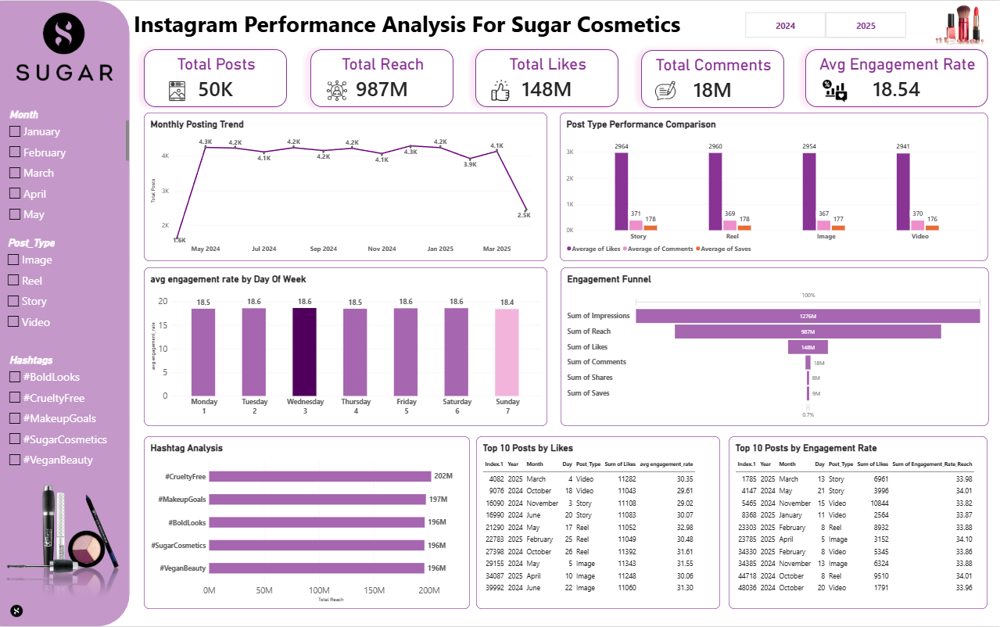

# 💄 Sugar Cosmetics: Instagram Performance Analytics

An end-to-end data analytics project analyzing **50,000 Instagram posts** (April 2024 – April 2025) for Sugar Cosmetics to evaluate overall account health, content performance, engagement funnels, and actionable growth strategies.

---

## 📊 Dashboard Preview



---

## 🛠️ Tech Stack & Methodology

* **SQL (MySQL Database)**: Data cleaning, CTEs, window functions, and views for scalable reporting.
* **Power BI**: Data modeling, custom DAX metrics, and interactive report design adhering to brand aesthetics.
* **PowerPoint**: Strategic executive presentation and business recommendations.

---

## 💡 Key Business Insights

1. **Account Scale & Health**: Analyzed 50K posts generating **987M Reach**, **148M Likes**, **18M Comments**, and an **18.54% Average Engagement Rate**.
2. **Content Format Leader**: **Stories (2,964 avg likes)** and **Reels (2,960 avg likes)** lead engagement, proving short-form visual content drives audience interaction.
3. **Posting Schedule**: Peak engagement occurs on **Tuesdays and Wednesdays (18.6% rate)**, while maintaining a consistent baseline of ~4.2K posts/month.
4. **Engagement Funnel Gaps**: High impression-to-reach conversion (**77.4%**), but identified a significant drop-off in share/save rates (**~1.7%**).
5. **Hashtag Performance**: `#CrueltyFree` generated the highest brand reach at **202M**, followed by `#MakeupGoals` (**197M**).

---

## 📂 Repository Structure

```text
├── SQL/             # MySQL scripts for view creation and aggregations
├── PowerBI/         # Power BI dashboard file (.pbix)
├── Presentation/    # Executive slide deck (.pptx & .pdf)
└── Images/          # Dashboard screenshots and visuals
